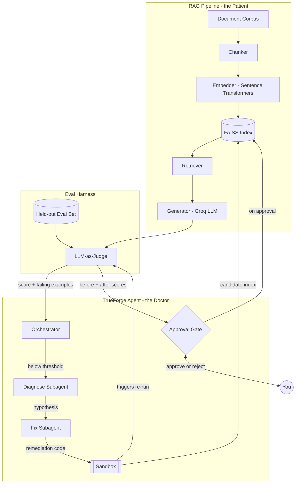
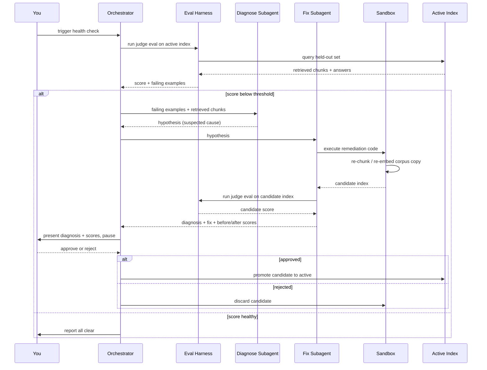

# RAG Doctor — Architecture & Data Flow

Self-healing RAG pipeline agent, built for the TrueForge Hackathon. The agent monitors a RAG pipeline's answer quality via an LLM-as-judge, diagnoses the cause when quality drops, tests a fix inside a sandbox, and promotes the fix only after human approval.

## System Architecture



**Components**

- **Patient (the RAG pipeline being healed):** a small, fixed toy corpus, chunked and embedded into a FAISS index, served through a standard retrieve-then-generate pipeline. Keep this simple — the interesting work happens in the Doctor layer, not here.
- **Eval Harness:** a held-out set of Q&A pairs the pipeline never sees in normal operation, scored by an LLM-as-judge on faithfulness and answer relevancy (1–5, structured JSON) — same pattern as your existing eval work.
- **Doctor (TrueForge agent):** the orchestrator runs the health check. On a bad score it hands off to Diagnose (forms a hypothesis), then Fix (executes a remediation in the sandbox and re-evaluates). Nothing reaches the active index without your approval at the gate.

## Data Flow (execution sequence)



**In plain steps:**
1. Trigger a health check — a manual command is fine, don't build real-time monitoring.
2. Eval harness scores the active index against the held-out set.
3. Below threshold (suggest: avg score < 3.5/5, or a 15%+ drop from baseline) → Diagnose subagent inspects failing queries + retrieved chunks, forms a hypothesis.
4. Fix subagent turns the hypothesis into remediation code, runs it in the sandbox against a **copy** of the corpus — never touch the active index directly.
5. Re-run the eval harness against the candidate index → before/after scores.
6. Orchestrator pauses, shows you the diagnosis and both scores.
7. You approve → candidate becomes active. You reject → candidate is discarded, active index untouched.

## Tech Stack

| Layer | Choice | Why |
|---|---|---|
| Agent harness | TrueForge | sponsor tool; subagents, sandbox, and approval gates are built in |
| Agent + judge + generation model | Groq API | fast inference, you already use it, generous free tier |
| Embeddings | Sentence Transformers (local) | no API rate limits, matches your existing RAG project |
| Vector index | FAISS (in-memory) | fastest to stand up, no DB server to manage this week |
| Code execution | TrueForge's built-in sandbox | no separate setup — this is where re-chunk/re-embed scripts actually run |
| Corpus/index storage | local filesystem, versioned folders | simplest possible versioning for a week-long build |
| Language | Python | matches your stack, runs cleanly in the sandbox |
| Frontend | TrueForge's built-in chat UI | skip building a custom UI, spend the saved time on agent logic |
| Version control | GitHub (public repo) | required for submission |

## Suggested Repo Structure

```
rag-doctor/
├── corpus/
│   ├── active/          # current production documents
│   └── candidate/       # working copy used to test fixes
├── pipeline/
│   ├── chunker.py
│   ├── embedder.py
│   ├── index.py         # FAISS wrapper, versioned (active/candidate)
│   ├── retriever.py
│   └── generator.py
├── eval/
│   ├── eval_set.json    # held-out Q&A pairs
│   └── judge.py         # LLM-as-judge scorer
├── agent/
│   ├── orchestrator.py  # TrueForge entrypoint, ties the loop together
│   ├── diagnose.py      # diagnose subagent
│   └── fix.py           # fix subagent
├── sandbox_scripts/
│   └── remediate.py     # the actual re-chunk/re-embed code the sandbox runs
└── README.md
```
