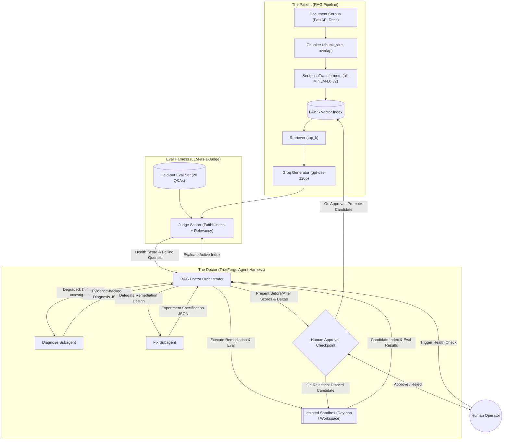
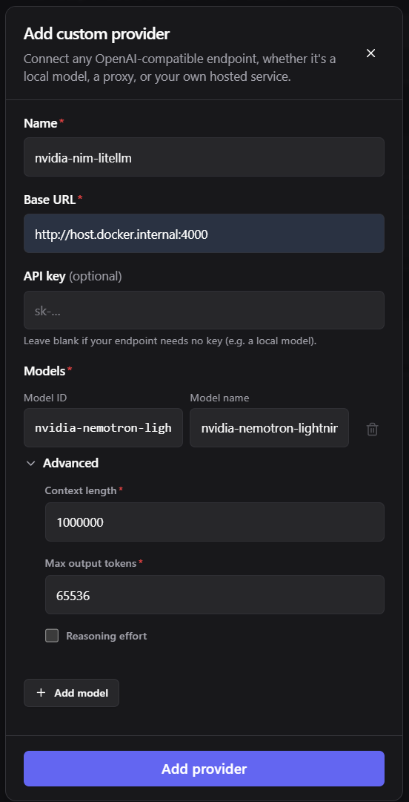

# RAG Doctor 🩺 — Autonomous Self-Healing RAG Pipeline Agent

> **TrueForge Agent Harness Hackathon Project**  
> An autonomous self-healing agent that monitors RAG pipeline answer quality using an LLM-as-a-judge, diagnoses quality degradation, executes remediation in an isolated sandbox, and promotes verified candidate indices only upon explicit human approval.

[](tests/)
[](https://www.python.org/)
[](https://github.com/truefoundry/trueforge)
[](https://github.com/KaushalFrancisJ/rag-doctor/pull/2)

---

## 📌 Links & Submission Details

- **GitHub Repository**: [https://github.com/KaushalFrancisJ/rag-doctor](https://github.com/KaushalFrancisJ/rag-doctor)
- **Merged Qodo Pull Request**: [https://github.com/KaushalFrancisJ/rag-doctor/pull/2](https://github.com/KaushalFrancisJ/rag-doctor/pull/2)
- **Demo Video (3 mins)**: *[Link to 3-Minute Demo Video]*
- **Blog Post Write-Up**: *[Link to Hackathon Blog Post]*

---

## 📖 What RAG Doctor Does & How It Uses TrueForge

In production RAG systems, quality drops silently due to document changes, sub-optimal chunk sizing, or poor retrieval parameters. Traditional monitoring only alerts after users complain, and debugging requires manual, error-prone human intervention.

**RAG Doctor** solves this with a fully autonomous **Doctor-Patient Architecture** powered by **TrueForge**:

1. **The Patient (Fixed RAG Pipeline)**: A lightweight RAG pipeline built with SentenceTransformers (`all-MiniLM-L6-v2`), local FAISS vector index, top-k retriever, and Groq LLM generator (`openai/gpt-oss-120b`).
2. **The Eval Harness (LLM-as-a-Judge)**: A held-out evaluation dataset of 20 realistic questions and ground-truth answers evaluated on **Faithfulness** (1–5) and **Answer Relevancy** (1–5).
3. **The Doctor (TrueForge Agent Harness)**:
   - **Orchestrator Agent (`rag-doctor`)**: Coordinates health checks, delegates tasks to specialized subagents, presents findings, and enforces human approval gates.
   - **Diagnose Subagent (`diagnose`)**: Reads failing queries, context chunks, and configurations via MCP to form an evidence-backed root cause hypothesis (e.g. *chunking problem*, *retrieval problem*).
   - **Fix Subagent (`fix`)**: Formulates a concrete remediation experiment specification with exact parameter adjustments (`chunk_size`, `overlap`, `top_k`).
   - **TrueForge Isolated Sandbox**: Executes re-chunking, re-embedding, candidate index generation, and candidate evaluation inside an isolated Daytona sandbox workspace without modifying production state.
   - **TrueForge Human Approval Checkpoint**: Native interactive gate that presents before/after scores, score deltas, and regression checks before promoting a fix.
   - **Model Context Protocol (MCP)**: Custom MCP server exposing 9 controlled tools for pipeline inspection, health diagnostics, comparison, promotion, and rollback.

---

## 🏗️ System Architecture & Data Flow



### Self-Healing Execution Lifecycle

```
Degraded Active Index (Score: 3.83 / 5.0)
       ↓
Diagnose Subagent (Hypothesis: Chunk size 70 is truncating context)
       ↓
Fix Subagent (Experiment: chunk_size=500, overlap=100)
       ↓
TrueForge Sandbox (Re-chunk corpus copy, build candidate index, run judge eval)
       ↓
Candidate Evaluation (Candidate Score: 4.58 / 5.0, Delta: +0.75, Regressions: 0)
       ↓
Human Approval Gate (Prompt: "Promote exp_001 to active?")
       ↓
Explicit Approval → Promote candidate to active (indexes/active.json) & preserve previous version
```

---

## 📁 Repository Structure

```
rag-doctor/
├── corpus/
│   ├── active/               # Production FastAPI documentation documents
│   └── candidate/            # Isolated working copy for sandbox experiments
├── indexes/
│   ├── active.json           # Active index pointer (tracks current active & baseline)
│   ├── v001/                 # Healthy baseline index (chunk_size: 500, overlap: 100)
│   └── v002_sick/            # Degraded index for demo (chunk_size: 70, overlap: 0)
├── eval/
│   ├── eval_set.json         # 20 held-out evaluation questions & ground truths
│   ├── judge.py              # LLM-as-judge evaluator (Faithfulness & Answer Relevancy)
│   ├── compare.py            # Evaluation comparison & delta regression analyzer
│   ├── baseline_results.json # v001 evaluation report (Score: 4.58 / 5.0)
│   └── sick_results.json     # v002_sick evaluation report (Score: 3.83 / 5.0)
├── pipeline/
│   ├── chunker.py            # Text chunking with configurable overlap
│   ├── embedder.py           # SentenceTransformers local embedding generator
│   ├── index.py              # FAISS index wrapper with atomic persistence
│   ├── retriever.py          # Top-k similarity retriever
│   └── generator.py          # Groq LLM answer generator with exponential backoff
├── agent/
│   ├── orchestrator.py       # TrueForge orchestrator workflow & promotion engine
│   ├── diagnose.py           # Diagnose subagent (evidence analysis + root-cause reasoning)
│   └── fix.py                # Fix subagent (remediation experiment designer)
├── sandbox_scripts/
│   └── remediate.py          # Deterministic candidate index builder executed in sandbox
├── tests/
│   ├── test_approval.py      # Human approval, promotion & rollback tests
│   ├── test_compare.py       # Evaluation comparison & regression check tests
│   ├── test_eval.py          # LLM-as-judge & index isolation tests
│   ├── test_pipeline.py      # Core RAG pipeline unit & integration tests
│   ├── test_remediate.py     # Sandbox remediation executor tests
│   └── test_trueforge_config.py # TrueForge YAML and Docker Compose tests
├── trueforge.yaml            # Declarative TrueForge agent & subagent definitions
├── trueforge-models.yaml     # TrueForge model catalog presets (Google Gemini)
├── trueforge-sandbox.yaml    # TrueForge sandbox presets (Daytona)
├── trueforge-mcp.yaml        # TrueForge MCP connector definition
├── mcp_server.py             # RAG Doctor MCP Server (FastMCP, stdio + SSE transport)
├── Dockerfile.mcp            # Container image for MCP server & Python runtime
├── Dockerfile.trueforge      # Container image for TrueForge server
├── docker-compose.yml        # Docker Compose multi-container setup
├── requirements.txt          # Python dependencies
└── .env.example              # Environment variable template
```

---

## ⚙️ Setup & Quickstart

### 1. Prerequisites

- **Python 3.12**
- **Docker & Docker Compose** (for containerized execution)
- **Node.js 20+** (only if running TrueForge locally without Docker)
- API Keys:
  - `GEMINI_API_KEY`: [Google AI Studio](https://aistudio.google.com/)
  - `GROQ_API_KEY`: [Groq Console](https://console.groq.com/)
  - `DAYTONA_API_KEY`: [Daytona Dashboard](https://app.daytona.io/) (optional, for remote sandboxes)

### 2. Environment Configuration

Create your `.env` file from `.env.example`:

```bash
cp .env.example .env
```

Populate your `.env` file:

```env
# TrueForge Agent Model Configuration (Google Gemini Native Provider)
GEMINI_API_KEY=your_gemini_api_key_here

# Groq API Configuration (for Patient RAG & LLM-as-judge)
GROQ_API_KEY=gsk_your_groq_api_key_here
GROQ_MODEL=openai/gpt-oss-120b

# TrueForge Sandbox Provider (Daytona)
DAYTONA_API_KEY=your_daytona_api_key_here

# TrueForge Catalog Paths
MODEL_CATALOG_PATH=./trueforge-models.yaml
SANDBOX_CATALOG_PATH=./trueforge-sandbox.yaml
MCP_CATALOG_PATH=./trueforge-mcp.yaml
```

---

## 🐳 Option A: Run with Docker Compose (Recommended)

Run the full stack with a single command:

```bash
docker compose up -d --build
```

This starts:
1. **`rag-doctor-mcp`** (Port `8000`): FastMCP server serving RAG Doctor inspection and healing tools over SSE.
2. **`rag-doctor-trueforge`** (Port `8790`): TrueForge Agent server and Web UI, with persistent SQLite volume (`trueforge-data:/root/.local/share/trueforge`).
3. **`rag-doctor-init`**: Automated bootstrap container that registers Gemini, Daytona, MCP server, and agents with TrueForge.

Open your browser to:
👉 **`http://localhost:8790`**

---

## 💻 Option B: Run Locally

### 1. Python Environment

```bash
# Create and activate Python 3.12 virtual environment
python3.12 -m venv .venv
source .venv/bin/activate  # On Windows: .venv\Scripts\Activate.ps1

# Install dependencies
pip install -r requirements.txt
```

### 2. Start the RAG Doctor MCP Server

```bash
python mcp_server.py --transport sse --port 8000
```

### 3. Start TrueForge Agent Server

In a second terminal:

```bash
npx @truefoundry/trueforge
```

### 4. Bootstrap TrueForge Settings & Agents

In a third terminal:

```bash
python scripts/setup_trueforge.py --host http://localhost:8790 --mcp-url http://localhost:8000/sse
```

Open **`http://localhost:8790`** in your browser.

---

## ⚡ Optional: Custom Model Provider (NVIDIA NIM via LiteLLM Proxy)

RAG Doctor supports routing custom models (such as `nvidia-nemotron-lightning`, `deepseek-v4-flash`, or `kimi-k2.6`) via an OpenAI-compatible LiteLLM proxy:

- **LiteLLM Proxy Repository**: [https://github.com/KaushalFrancisJ/litellm-proxy-nvidia-nim](https://github.com/KaushalFrancisJ/litellm-proxy-nvidia-nim)



### Setting Up the Proxy

1. Clone and launch the proxy from [litellm-proxy-nvidia-nim](https://github.com/KaushalFrancisJ/litellm-proxy-nvidia-nim):
   ```bash
   litellm --config config.yaml --host 0.0.0.0 --port 4000
   ```
2. In TrueForge UI (`http://localhost:8790`):
   - Navigate to **Settings → Model Providers → Add Provider**.
   - Select **OpenAI (Compatible)**.
   - Set **Base URL**: `http://host.docker.internal:4000` (if running TrueForge in Docker) or `http://localhost:4000` (if running locally).
   - Add model: `nvidia-nemotron-lightning` with context length `1000000` and max tokens `65536`.

---

## 🛠️ MCP Tools Reference

The RAG Doctor MCP Server exposes 10 controlled tools adhering to strict least-privilege principles:

| MCP Tool | Description |
|---|---|
| `query_rag_pipeline` | Asks any question directly to the Patient RAG pipeline on active or specified index, returning generated answer & chunks. |
| `inspect_rag_health` | Returns health status (`DEGRADED`/`HEALTHY`), active vs baseline score, failing query counts, and available indices. |
| `get_pipeline_config` | Returns chunk size, overlap, and embedding parameters for a specified index version (defaults to active). |
| `get_failed_queries` | Returns failing questions with ground-truth answers, generated responses, and retrieved chunks. |
| `get_evaluation_results` | Returns summary metrics (faithfulness, relevancy, overall score, passing counts). |
| `inspect_retrieval` | Runs ad-hoc vector retrieval for debugging chunk relevance and rank cutoff. |
| `create_experiment` | Runs isolated sandbox remediation, builds candidate index, evaluates it, and returns structured comparison. |
| `compare_experiments` | Compares candidate evaluation reports against current degraded and baseline scores. |
| `promote_experiment` | Atomically promotes an approved candidate index to active, updates `active.json`, and records metadata. |
| `rollback_experiment` | Rolls back the active index to the baseline or a previous known-good version. |
| `discard_experiment` | Discards candidate experiment artifacts without modifying the active index. |

---

## 🧪 Testing & Verification

Run the comprehensive 51-test suite:

```bash
pytest
```

The test suite validates:
- Core RAG pipeline (chunking, embedding, FAISS indexing, retrieval, generation)
- LLM-as-judge scoring and evaluation report formatting
- Degradation detection thresholds (score < 3.5 or >15% drop)
- Diagnosis and Fix subagent JSON schemas
- Sandbox isolation and active index immutability
- Candidate evaluation comparison and regression detection
- Human approval presentation formatting, atomic promotion, and rollback

---

## 🔍 Qodo Code Review Evidence

- **Merged Pull Request**: [https://github.com/KaushalFrancisJ/rag-doctor/pull/2](https://github.com/KaushalFrancisJ/rag-doctor/pull/2)

### What Qodo Surfaced & Architectural Refinements Made

During the development of the self-healing pipeline, Qodo code reviews surfaced critical findings around:

1. **Active Index Immutability**:
   - *Finding*: Remediation experiments had a potential risk of mutating active index files or state pointers during trial runs.
   - *Resolution*: Implemented strict candidate index isolation in [`sandbox_scripts/remediate.py`](file:///C:/Personal/Project/rag-doctor/sandbox_scripts/remediate.py). Active index pointers (`indexes/active.json`) are locked and verified against pre-execution hashes, guaranteeing that active indices remain completely untouched during candidate re-chunking, re-embedding, and evaluation.

2. **Candidate Reconstruction & Sandbox Separation**:
   - *Finding*: Promoting candidate indices created inside isolated cloud sandboxes (e.g. Daytona) could fail on the host server if artifacts were not synchronized.
   - *Resolution*: Added automatic candidate index reconstruction logic to [`agent/orchestrator.py`](file:///C:/Personal/Project/rag-doctor/agent/orchestrator.py) and `promote_experiment`, ensuring that approved parameters are deterministically applied to host index storage upon human approval.

3. **Schema Strictness for Agent Reasoning**:
   - *Finding*: Subagent outputs without rigid JSON schema constraints could cause downstream pipeline parsing errors.
   - *Resolution*: Enforced structured JSON schemas (`json_schema` with `strict: true`) for both the `diagnose` subagent (7 enumerated root-cause categories) and the `fix` subagent (parameter constraints and validation).

4. **Regression Check Verification**:
   - *Finding*: Evaluating average scores alone could hide individual query regressions where previously passing queries fail on a candidate index.
   - *Resolution*: Implemented per-query regression tracking in [`eval/compare.py`](file:///C:/Personal/Project/rag-doctor/eval/compare.py), explicitly flagging degraded queries in the human approval presentation.

---

## 📜 Hackathon Compliance & Track Alignment

- **Required Technology (Rule 3)**: Built natively on **TrueForge v0.1.4**, utilizing its Orchestrator, Subagent delegation (`create_sub_agent`), Sandbox integration (Daytona), MCP tool integration, and native `ask-user-question` approval checkpoints.
- **Code Review (Rule 4)**: All core self-healing features and architectural components were developed through reviewed pull requests (see [PR #2](https://github.com/KaushalFrancisJ/rag-doctor/pull/2)).
- **Open Source (Rule 6)**: Publicly accessible under the MIT License with complete local and containerized replication instructions.
- **Data & Credentials (Rule 7)**: No proprietary or login-protected data used; standard FastAPI public documentation subset and configurable API key environment variables.
- **No Fabricated Results**: Complete baseline (`v001`: 4.58 / 5.0) and degraded (`v002_sick`: 3.83 / 5.0) evaluation reports are committed in [`eval/`](eval/) with full per-query logs.
